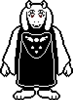

+++
title = "Undertale Test"
date = "2024-05-06"
draft = false
pinned = false
image = ""
+++

## Welcome to the Undertale Wiki

Explore the world of [Undertale](https://undertale.com/) and its captivating lore.

Long ago, a war between humans and monsters led to the monsters being sealed underground by a powerful spell. The game follows a human child who falls into this underground realm and navigates through a world of choices, where interactions with monsters determine the outcome. The narrative explores morality and consequences.

## Characters

### Frisk

The Main Character

#### Physical Appearance:

Frisk's appearance is simple and deliberately vague. They have short brown hair and wear a striped, horizontally-striped light blue-and-white shirt with brown pants and shoes. Frisk's design is intentionally plain to allow players to project their own interpretations onto the character.

#### Role in the Game:

In the game's narrative, Frisk is a human who falls into the Underground, a world inhabited by monsters. The player controls Frisk throughout the game and guides their interactions with the various characters they encounter. Frisk's journey in the Underground and their interactions with monsters form the core of the game's story. Frisk's actions and decisions are determined by the player's choices, and these choices shape the outcome of the story and the relationships Frisk develops with the other characters. Players can choose to be kind and spare monsters or engage in combat and defeat them.

#### Personality:

Since Frisk is a silent protagonist, their personality is largely left up to the player's interpretation. However, due to their actions being driven by the player's choices, Frisk can be seen as compassionate and empathetic if the player chooses to take the pacifist route, sparing monsters and seeking peaceful solutions. Alternatively, if the player chooses a more aggressive route, Frisk's personality might seem more determined and assertive. Interactions: Throughout the game, Frisk interacts with various characters, forming relationships with them based on the player's choices. The most notable relationships are with characters like Toriel, Sans, Papyrus, Undyne, Alphys, and Asriel, among others. The player's choices ultimately determine the kind of friendships and connections Frisk develops in the Underground. Frisk's interactions also heavily impact the ending of the game, as their choices determine whether they achieve a pacifist, neutral, or genocide ending. Importance to the Story: Frisk's presence in the game serves as a vessel for the player to experience the world of Undertale and its unique mechanics. Their choices and interactions drive the story forward, affecting the outcomes of different events and determining the ultimate fate of the characters in the game. Overall, Frisk is intentionally designed to be a blank canvas onto which players can project their own emotions, morals, and choices, making their journey through the Underground a highly personal and immersive experience.

### Sans

He's a Skeleton

Sans is a short skeleton with a round skull and two eye sockets. His eyes are often depicted as pinpricks of white light, giving him a laid-back and somewhat lazy appearance. He wears a blue hoodie with a stylized Delta Rune on the front, as well as a pair of brown slippers. His hoodie covers most of his body, but his limbs and skeletal structure are still visible.

#### Personality:

Sans is known for his relaxed and easygoing demeanor, often cracking puns and jokes. He's characterized by his nonchalant attitude, which can sometimes border on apathy. However, beneath his carefree exterior lies a more complex personality. He is aware of the various timelines and events occurring in the game due to his connections with the game's meta-narrative, which can give him a sense of fatigue and existential crisis.

#### Role in the Game:

Sans is one of the characters the player encounters in the underground world of monsters. He lives in Snowdin, a snowy area filled with puzzles and quirky characters. Sans and his brother Papyrus are guards at the entrance to Snowdin, although Sans rarely takes his duties seriously. He often appears to offer the player cryptic advice and comic relief. As the game progresses, it becomes clear that Sans is more aware of the player's actions and the time loops within the game's universe. He plays a crucial role in certain story routes, and his true abilities are revealed during battles, where he exhibits powerful attacks that make him a challenging opponent.

#### Backstory and Lore:

Sans' backstory is only hinted at in the game, but it's implied that he and his brother Papyrus were scientists who conducted research related to time and space manipulation. This is why Sans seems to have some awareness of the game's mechanics and the player's actions. Overall, Sans is a unique and memorable character in "Undertale" due to his blend of humor, depth, and mystery. His impact on the game's story and his interactions with the player make him a fan-favorite character.

### Sans Fight

<https://jcw87.github.io/c2-sans-fight/>

### Toriel

She's Toriel...

#### Physical Appearance:

Toriel is a goat-like monster with a warm and motherly appearance. She has white fur, a pair of curved horns, and wears a purple robe that covers most of her body. Her eyes are kind and gentle, reflecting her caring and protective nature. She also wears glasses, which is a unique characteristic among the monsters in the game.

#### Personality:

Toriel is known for her motherly and nurturing personality. She is incredibly kind-hearted and cares deeply for others, especially for the safety and well-being of the protagonist. Due to her role as the "caretaker of the Ruins," she takes it upon herself to protect and guide any human who falls into the Underground, including the player character.

#### Role in the Game:

At the beginning of the game, Toriel acts as a mentor and guide for the player, teaching them about game mechanics, puzzles, and the world of monsters. She lives in the Ruins, a labyrinthine area beneath the surface, and offers the player a safe place to stay. Toriel's initial reluctance to let the player leave her care and venture further into the Underground sets up an early conflict in the game's narrative. Depending on the player's choices, interactions with Toriel can lead to different outcomes. Players can either choose to follow her advice and stay in the Ruins or challenge her and continue on their journey. This choice contributes to the branching paths and multiple endings that define "Undertale."

#### Backstory and Lore:

Toriel's backstory is gradually revealed through dialogue and exploration. She was once the queen of the monsters and lived on the surface. However, following a war between humans and monsters, she retreated to the Underground, hoping to protect her kind from the dangers above. Her backstory and her reasons for caring for the protagonist are explored more deeply in the game's Pacifist and Neutral routes.

#### Importance to the Story:

Toriel's character embodies themes of compassion, family, and choice. Her interactions with the player character highlight the game's central moral dilemma: whether to approach challenges with violence or find peaceful solutions. The relationships players form with characters like Toriel contribute to the emotional impact of the story's various endings. In summary, Toriel is a maternal and compassionate character in "Undertale," representing themes of love, protection, and the consequences of one's choices. Her role in the game is pivotal in introducing players to its unique mechanics and setting the tone for their interactions with other characters.

### Asgore

He's Asgore...

#### Physical Appearance:

Asgore is a large, anthropomorphic goat monster with a regal and imposing presence. He has white fur, curved horns, and a beard, which give him a dignified appearance. Asgore wears a red robe with a golden royal emblem on the front and a crown atop his head. His eyes are somber, reflecting the weight of his responsibilities and past decisions.

#### Personality:

Asgore is characterized by his sorrowful and conflicted personality. He carries the burden of past mistakes and the consequences of a war between humans and monsters. Despite his imposing appearance, he is a gentle and compassionate soul who deeply regrets the loss of life and the suffering caused by the war. He values the lives of all creatures and wishes for a peaceful resolution to the conflict.

#### Role in the Game:

Asgore serves as the ruler of the monsters in the Underground. He resides in the Dreemurr Castle and plays a crucial role in the game's narrative. The player's interactions with Asgore are central to the game's various routes and endings. In the Pacifist route, players strive to find a way to spare Asgore and achieve a peaceful resolution to the conflict. In the Genocide route, players confront Asgore as a significant boss battle.

#### Backstory and Lore:

Asgore's backstory is closely tied to the history of the monsters and their relationship with humans. He was once married to Toriel, and they ruled together as king and queen. However, their child's death led to the escalation of tensions between humans and monsters, culminating in the war that led to monsters being trapped Underground. Asgore's role as the ruler weighs heavily on him, and he seeks a way to break the barrier and free his people.

#### Importance to the Story:

Asgore's character embodies themes of forgiveness, redemption, and the cycle of violence. Players are presented with a moral dilemma when facing Asgore: whether to continue the cycle of violence by defeating him or to find a way to spare him and seek a peaceful resolution. Asgore's actions and motivations are pivotal in shaping the game's different routes and the ultimate fate of the characters. In the Pacifist route, Asgore's interactions with the player and their decisions to spare him contribute to the game's message of hope and reconciliation. His character arc underscores the importance of understanding, empathy, and the power of choices. Overall, Asgore is a complex and multi-dimensional character in "Undertale." His presence in the game challenges players to consider the consequences of their actions and the potential for healing and growth, even in the face of past mistakes and tragedies.

[Download Undertale](download.html)